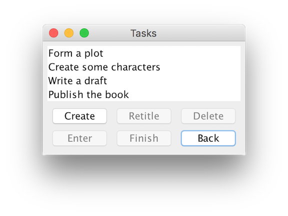

# BabySteps

A unique task manager and to-do application written in Java. The
project has no dependencies outside the standard library.

## Purpose

You're procrastinating. There's something you must do, but you just
can't get started. You're not procrastinating due to a lack of
motivation. You *really want* to complete the job. You're overwhelmed
by the task and paralyzed as a result.

**BabySteps** is here to help. This task organizer lets you break down
a job into tiny, bite size pieces. After assembling these subtasks,
**BabySteps** let's you see only the simplest task.

For example, let's suppose you want to write a book. To *write a book*
you need to form a plot, create some characters, write a draft, and
publish the work. To *form a plot*, the author must create an
introduction, a climax, and a resolution. An *introduction* should
establish the setting, introduce the characters, and start the
story. Notice how each job can be divided into smaller tasks?

Writing a book seems like an impossible undertaking. Splitting the
task into **BabySteps** makes things much more manageable. This method
also empowers and gives you a sense of achievement on your journey.

## Screenshot

## Design

The architecture of **BabySteps** splits classes into two components: the
model and the user interface (or view). The model manages a B-tree of
tasks and their statuses. `TaskModel` specifically communicates with
the UI via the
[observer pattern](https://en.wikipedia.org/wiki/Observer_pattern). The
UI presents the tasks to the user and interacts with the model through
a set of `ActionListeners`.
